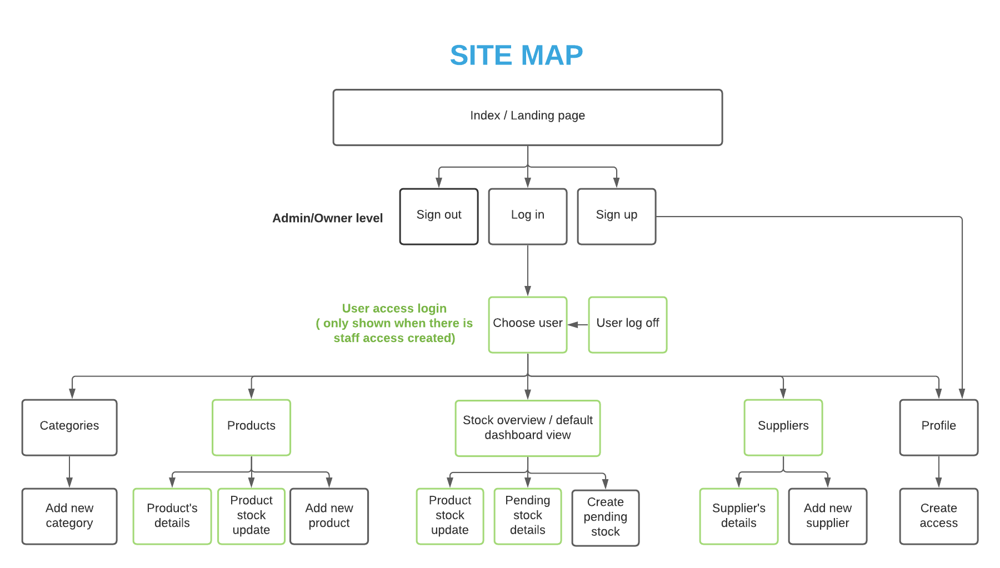
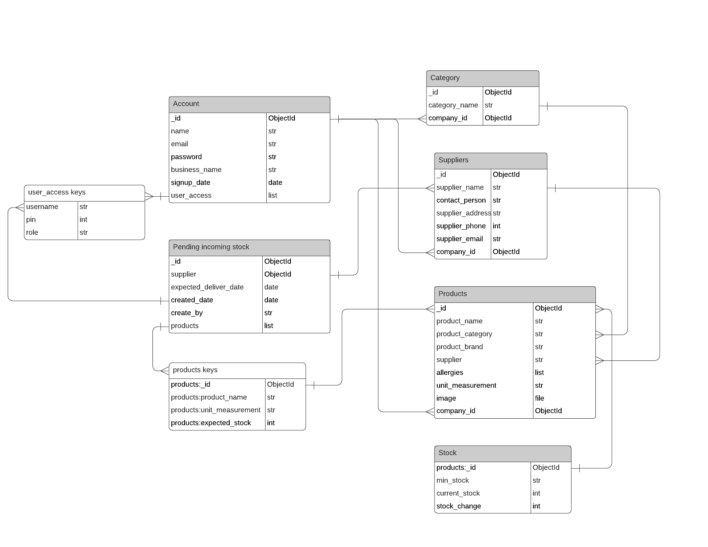

# Stock Management App
## Introduction
Project milestone 3 for Code Institute Full-stack development program: backend development using Python-Flask and MongoDB.

The purpose of the project is to create a stock management app which helps small business owners automate the process of tracking the stock flow and move away from spreadsheets or pen and paper which are prone to human errors. This project is for educational purpose to build a full-stack site showcasing data handling, database structure, CRUD user functionality. The problem to which this app is the solution, is based on a real life problem I have as co-owner of a take-away shop selling Asian food; therefore the business logic behind the app is drawn from I how would like to operate the stock flow management in my business.

## Showcase

## Table of Contents
  - [User Experience (UX)](#user-experience-ux)
    - [User Stories](#user-stories)
    - [Strategy](#strategy)
    - [Scope](#scope)
    - [Structure](#structure)
      - [Information Architecture](#information-architecture)
      - [Data Structure](#data-structure)
    - [Skeleton](#skeleton)
      - [Design](#design)
      - [Wireframes](#wireframes)
      - [Design changes](#design-changes)
  - [Features](#features)
    - [Existing features](#existing-features)      
    - [Future implementations](#future-implementations)
  - [Technologies used](#technologies-used)
    - [Languages](#languages)
    - [Frameworks, Libraries & Programs](#frameworks-libraries--programs)
  - [Testing](#testing)
  - [Deployment](#deployment)
    - [Development](#development)
    - [GitHub Pages](#github-pages)
    - [Cloning the project locally](#cloning-the-project-locally)
    - [Forking the repository](#forking-the-repository)
  - [Credits](#credits)
    - [Code](#code)
    - [Content](#content)
    - [Media](#media)
    - [Acknowledgements](#acknowledgements)

## User Experience (UX)
### User Stories
* As a new visitor, I want to:
  * know what the app is about upon landing the site.
  * be able to sign up in order to start using the app.
   
* As a user/ a business owner/ admin user, I want to:
  * create/read/update/delete user access to my staff with limited privileges.
  * create/read/update/delete suppliers that I order stock from.
  * create/read/update/delete product categories.
  * create/read/update/delete products.
  * see a list of products I have in my inventory grouped by categories.
  <!-- * search for a supplier in the product list.
  * search for a category in the product list. -->
  * search for a product in the product list.
  * update products' stocks.
  * create a pending order for incoming stock.
  * see the details of pending incoming stock orders in order to confirm and update the stock change according.
  * be notified when a product has reached its minimum stock available in order to restock on time.  
  <!-- * create a request a list of products that need to be restocked. -->
  <!-- * be notified and approve restock request. -->

* As a user with staff privilege, I want to:
  * see a list of products avaible in the inventory grouped by categories.
  <!-- * search for a supplier in the product list.
  * search for a category in the product list. -->
  * search for a product in the product list.
  * update products' stocks.
  * see the details of pending incoming stock orders in order to confirm and update the stock change according.
  <!-- * create a request a list of products that need to be restocked. -->

### Strategy
The idea behind this project is based on my current need for an automated process to control stock flow for my business. The current process of recording stock in and out is very manual without detailed records of how much stock is going in and how much is taken out. When there is a need to check the stock level, staff is asked to go through the entire inventory in the storage to eyeball which product needs to be restocked. This often results in human errors where they miss out certain products which leads to buying the missing products at retail shops at higher price or not able to buy at all due to too short notice. Therefore the objective of this stock management app is to allow business owners to create a common database of all the products available is the inventory, be notified when a product has reached it minimum stock allowed, and see the stock flow coming in and out.

### Scope
1. Content requirements
* Introduction what the app is about upon landing
* List of: product categories / products (grouped by categories) / suppliers / staff acess
* Detailed information of: products / suppliers
* Stock flow info:
  * Products with stock change today
  * Expected delivery
  * Products that have reacherrd their minimum stock level allowed

2. Functionality requirements
* Super-user account:
  * Sign up / Log in
  * Edit profile
* CRUD functionality to create staff access with limited privileges
* CRUD functionality for product categories / products / suppliers
* Stock flow update:
  * Enter number of stock change for a chosen product
  * Auto calculate current stock level after update
* Pending stock inflow:
  * Create a pending stock inflow: stock expected to be delivered by suppliers
  * Update stock change and change status of pending stock inflow to done
* Dashboard view:
  * Minimum stock level is reached
  * Pending stock inflow
  * List of products with stock change today

### Structure
#### Information Architecture

The site map above shows the architecture of the app. Upon landing the app, business owner can create an account for their business with admin privilege. Once successfully registered, they are redirected to Profile page where they can create access to their staff with limited privileges which are marked with green borders. There are two redirecting options upon admin's logging in:
* if admin hasn't created any access for staff, admin is redirected to dashboard stock overview page.
* if admin has created access for other staff, a further user access login page is shown so that admin and staff has to select their respective username and input password in order to authenticate and render the correct viewing permissions for users. In real life application, I imagine the app is used on-site on a tablet that belongs to the business so the app is always logged in for that one business. Consequently, this "Choose user" step is the default landing page so that staff can easily and quickly access stock overview page when they are on duty of receiving or taking out stock. Staff is not allowed to log in the database without the admin login so that they cannot manipulate the stock levels elsewhere.

#### Data Structure

### Skeleton
#### Design
* CSS framework chosen for this project is [MaterializeCSS](https://materializecss.com/), which is created and designed by Google. This framework is chosen for its clean, simple and clear response UI design, which is easy for novice users to navigate and interact with data and database.

* Color: I want to keep the color scheme as simple as possible in order to avoid too much distractions. The key color of the app is blue as blue hints a sense of business profressional and trustworthy. Therefore, blue will be used on the main action buttons, headings, and other highlighting purposes. Other than that, universal traffic light colors are used for other actions such as red for `delete` action, yellow for `pending`, green for `approve` and `done`. Primary texts are written in black `#212121` while secondary texts are gray-ish `#BDBDBD`. Below image shows color schemes which is based on Materialize CSS color palette.

* Font: Roboto is the main font used for this app as it is a simple easy-to-read font which is suitable for all device sizes.
#### Wireframes
* Wireframes for mobile: [View](readme-assets/skeleton-wireframe-mobile.png)
* Wireframes for desktop: [View](readme-assets/skeleton-wireframe-desktop.png)
* Collection of forms being utilized: [View](readme-assets/skeleton-wireframe-forms.png)
* Tablet version will be similar to mobile version with an exception that the side navigation bar will remain visible instead of collasped. The `edit` pages (and edit forms) will be similar in design as `create` with some minor adjustments in text and actions.
#### Design changes

## Features
### Existing Features

### Future Implementations

## Technologies Used
### Languages
* [HTML5](https://developer.mozilla.org/en-US/docs/Web/Guide/HTML/HTML5) - build up layout and content of the application.
* [CSS3](https://developer.mozilla.org/en-US/docs/Web/CSS) - add custom styling and override Bootstrap stylings to fit with the theme of the website.
* [JavaScript](https://www.javascript.com/) - to add interactive functionailities to the app
* [Python](https://www.python.org/) - to build backend functionalities handling data, database interaction, and CRUD functionalities.
  
### Programs & Tools
* [Figma](https://www.figma.com/) -  for wireframe creation.
* [Visual Studio Code](https://code.visualstudio.com/) - the code editor being used to build the project.
* [Chrome DevTools](https://developer.chrome.com/docs/devtools/) - used heavily for debugging during development and testing process.
* [Git](https://git-scm.com/) - the built-in Git feature in VS Code was used for version control and push to github.
* [Github](https://github.com/) - Github is used to store project's code remotely. 
* [Google Fonts](https://fonts.google.com/) 
* [Font Awesome](https://fontawesome.com/), [Flaticon](https://www.flaticon.com/), and [Freepik](https://www.freepik.com/) - implement icons for navigation menu, social links, forms.
* [Autoprefixer CSS online](https://autoprefixer.github.io/) - to parse CSS and add vendor prefixes.
* [MongoDB](https://www.mongodb.com/) - the database being used to store application data and query.
  
### Frameworks and Libraries
* [MaterializeCSS](https://materializecss.com/) - the responsive front-end framework to build the layout and style the app.
* [Flask](https://palletsprojects.com/p/flask/) - a micro web framework written in Python which is the barebone of this stock management app.
* [Jinja2](https://jinja.palletsprojects.com/en/3.0.x/) - a web template engine which is used to generate markups.

## Testing

## Deployment
### Development

### Deployment to Heroku

### Cloning the project

### Forking the project

## Credits
### Code

### Content

### Media

### Acknowledgement